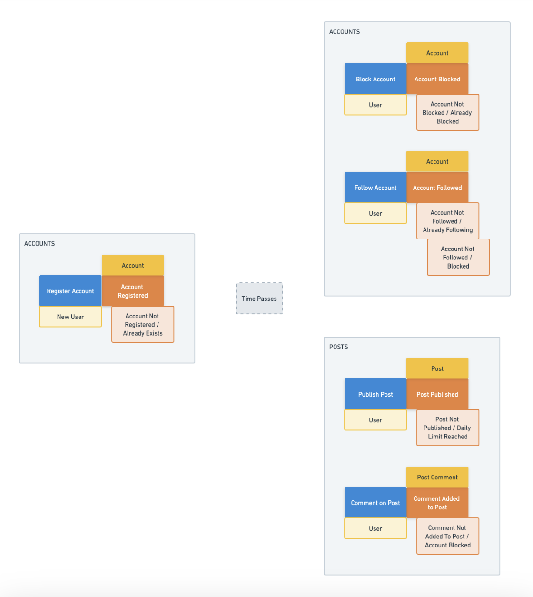
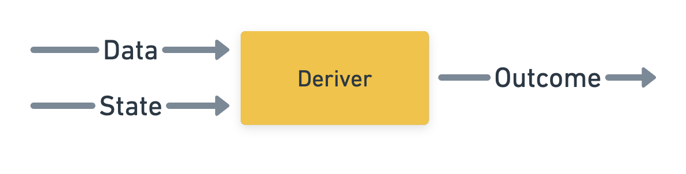

# Command Handlers

[Back to the workshop overview](https://github.com/PensionBee/ddd-workshop#ddd-workshop-overview)

## Context

In the [EventStorming](https://github.com/PensionBee/ddd-workshop/tree/eventstorming) section of the workshop, we used **Events**, **Commands** and **Entities** to design a solution for the problems our business is currently focused on.



Now that we've modelled our **Entities** and added repositories for saving and fetching them in an "always valid" way, we can now turn our **Command** and **Event** elements into code using "command handlers".

But first, let's talk about payloads...

### Payloads

We've already identified **Commands** as an intent to change the state of our system but we need to complete this picture by acknowledging that most **Commands** are only meaningful when there's relevant data attached. For example:

```ts
type PayInvoicePayload = {
  invoiceId: string;
  amountUSD: number;
  currency: "GBP" | "EUR" | "USD";
  paymentCardId: string;
};
```

Without this data, the `Pay Invoice` **Command** wouldn't be much use. Note that we'll use "command data" and "command payload" to mean the same thing moving forward.

### Command Handlers

A command handler is a function which processes one specific **Command** (with its payload). Command handlers are *not* a standard concept but we're borrowing heavily from the [Functional Domain Driven Design: Simplified](https://antman-does-software.com/functional-domain-driven-design-simplified) article to keep us away from "hardcore" Object-Oriented Programming or Functional Programming.

As a result, we're going to define a command handler as a function which carries out the following steps:

1. Parse incoming **Command** data
2. Fetch relevant 'state' (previously persisted **Entities** necessary to process the command)
3. Derive an **Event** (given **Command** data and fetched state)
4. Update the state of the system (for success **Events**)

Remember we're assuming 2 types of **Events**:

- Success **Events** (which result in changes to the system)
- Fail **Events** (which explicitly capture business rule violations, *not* technical errors)

Let's visualise this four step process with a JavaScript example:

```js
import z from "zod";

import { invoiceRepository } from "path/to/repositories/invoiceRepository.ts"; // Repositories are about to be put to good use
import { paymentCardRepository } from "path/to/repositories/paymentCardRepository.ts";

// Command Data Schema
// -------------------

const commandDataSchema = z.object({
  invoiceId: z.string().startsWith("invoice-"), // e.g. 'invoice-abjskPG188Ddkd2'
  amountUSD: z.number().positive(),
  currency: z.enum(["GBP", "EUR", "USD"]), // Must be one of these 3 values
  paymentCardId: z.string().startsWith("paymentCard-"), // e.g. 'paymentCard-18387stpPidDQ'
});

// Deriver
// -------

const deriveEvent = (data, state) => {
  // We'll look into this function shortly
};

// Command Handler
// ---------------

// Processes the 'Pay Invoice' Command
export const handlePayInvoice = async (commandData) => {
  // Step 1: Parse incoming Command data
  // -----------------------------------

  const data = commandDataSchema.parse(commandData);

  // Step 2: Fetch relevant 'state' (previously persisted Entities necessary to process the Command)
  // -----------------------------------------------------------------------------------------------

  const invoice = await invoiceRepository.findById(data.invoiceId); // Returns an invoice or null
  const paymentCard = await paymentCardRepository.findById(data.paymentCardId); // Returns a payment card or null

  // Throw an error if 'state' doesn't meet essential basic requirements.
  if (!invoice) {
    throw new Error("Invoice not found");
  }
  if (!paymentCard) {
    throw new Error("Payment card not found");
  }

  const state = {
    invoice,
    paymentCard,
  };

  // Step 3: 'Derive an event' (given Command data and fetched state)
  // ----------------------------------------------------------------

  const Event = deriveEvent(data, state);

  // Step 4: Update the state of the system (for success Events)
  // -----------------------------------------------------------

  switch (event.type) {
    case "INVOICE_PAYMENT_INITIATED":
      await invoiceRepository.save({
        ...state.invoice,
        status: event.payload.status, // Use the Event payload to update the invoice
      });
      break;
  }

  return event;
};
```

That's a lot to unpack but let's keep powering through for now.

### Events

Events are first-class citizens in our system. They capture information about state changes or state change attempts which failed due to business rule violations.

We can generalise an **Event** like so:

```ts
type Event = {
  type: Uppercase<string>; // The 'name' of the event
  payload: Record<string, unknown>; // Essential data related to the event
};
```

Here's an example of a success **Event**:

```ts
type InvoicePaymentInitiatedEvent = {
  type: "INVOICE_PAYMENT_INITIATED";
  payload: {
    invoiceId: string;
    status: "Initiated";
    amountUSD: number;
    currency: "GBP" | "EUR" | "USD";
    paymentCardId: string;
  };
};
```

NB: We also have the option to couple **Event** payloads to their corresponding **Entities**, e.g. `invoiceId: Invoice['id']` or `amountUSD: Invoice['amount']`. Coupling isn't always a bad thing and that's true here given **Events** are strongly coupled to **Entities** anyway. This approach just makes the relationship more explicit.

Here are two examples of fail **Events** (note we're using a union to capture multiple possible reasons for a single failure):

```ts
type InvoiceNotPaidEvent =
  | {
      type: "INVOICE_NOT_PAID/ALREADY_PAID";
      payload: {
        invoiceId: Invoice['id'];
      };
    }
  | {
      type: "INVOICE_NOT_PAID/COOL_OFF_PERIOD_ACTIVE";
      payload: {
        invoiceId: Invoice['id'];
        hoursUntilCoolOffPeriodEnds: number;
      };
    };
```

For fail events, the **Event** payload simply contains whatever information is useful for downstream processing of that failure.

### Derivers

Derivers are functions dedicated to handling the business rules governing our domain. For example: `Invoices cannot be paid within a 'cool off' period of 48 hours after being issued`.

*Note that business rules are where a large part of the *essential complexity* in software systems comes from, i.e. the stuff we can't easily simplify or improve because the world is inherently complex. This is in contrast to *accidental complexity* (i.e. tech debt), which arises from things like poor coding standards, insufficient automated testing, poor architecture patterns, a lack of problem/solution exploration or excessive time pressure.*

Derivers take data and state as arguments and return an **Event** (a success **Event** or a fail **Event**). We can visualise this process like so:



Derivers are simple functions by nature. They carry out business logic checks one at a time and if any check fails, the relevant fail **Event** is returned. If all checks pass, a success **Event** is returned. Additional business logic may be required if there are several possible success **Event** for a given **Command**.

Here's an example of a deriver for the above `handlePayInvoice` example

```js
import { getDifferenceInHours } from "path/to/timeUtils.ts";

const deriveEvent = (data, state) => {
  const { amountUSD, currency } = data;
  const { invoice, paymentCard } = state;

  // Check 1: has the invoice already been paid?
  if (invoice.status === "Paid") {
    return {
      type: "INVOICE_NOT_PAID/ALREADY_PAID",
      payload: {
        invoiceId: invoice.id,
      },
    };
  }

  // Check 2: is the invoice in it's cool off period?
  const now = new Date();
  const hoursSinceIssued = getDifferenceInHours(invoice.issuedAt, now);
  if (hoursSinceIssued < 48) {
    return {
      type: "INVOICE_NOT_PAID/COOL_OFF_PERIOD_ACTIVE",
      payload: {
        invoiceId: invoice.id,
        hoursUntilCoolOffPeriodEnds: 48 - hoursSinceIssued,
      },
    };
  }

  // Additional business rule checks go here...

  /**
   * All checks passed so return the relevant success event.
   * 
   * NB: It's not unreasonable for a downstream process to be responsible for actually
   * taking the payment (using an 3rd party payment provider). As a result, we're using
   * an "INVOICE_PAYMENT_INITIATED" success **Event** here rather than an "INVOICE_PAID"
   * event. This leads us down the path towards event-driven systems, which we'll cover
   * in the 'policies' section of the workshop.
   */
  return {
    type: "INVOICE_PAYMENT_INITIATED",
    payload: {
      invoiceId: invoice.id,
      status: "Initiated",
      amountUSD: amountUSD,
      currency: currency,
      paymentCardId: paymentCard.id,
    },
  };
};
```

## TypeScriptification

Let's pull everything together into a single example and sprinkle in some TypeScript:

```ts
import z from "zod";

import { type Invoice } from "path/to/entities/invoice.ts";
import { type PaymentCard } from "path/to/entities/paymentCard.ts";
import { invoiceRepository } from "path/to/repositories/invoiceRepository.ts";
import { paymentCardRepository } from "path/to/repositories/paymentCardRepository.ts";
import { getDifferenceInHours } from "path/to/timeUtils.ts";

// Types
// -----

type Data = z.infer<typeof commandDataSchema>;
type State = {
  invoice: Invoice;
  paymentCard: PaymentCard;
};
type Event =
  | {
      type: "INVOICE_PAYMENT_INITIATED";
      payload: {
        invoiceId: Invoice['id'];
        status: "Initiated" & Invoice['status']; // Ensures "Initiated" is a valid Invoice status
        amountUSD: Invoice['amount'];
        currency: Invoice['currency']
        paymentCardId: Invoice['paymentCardId'];
      };
    }
  | {
      type: "INVOICE_NOT_PAID/ALREADY_PAID";
      payload: {
        invoiceId: Invoice['id'];
      };
    }
  | {
      type: "INVOICE_NOT_PAID/COOL_OFF_PERIOD_ACTIVE";
      payload: {
        invoiceId: Invoice['id'];
        hoursUntilCoolOffPeriodEnds: number;
      };
    };

// Command Data Schema
// -------------------

const commandDataSchema = z.object({
  invoiceId: z.string().startsWith("invoice-"),
  amountUSD: z.number().positive(),
  currency: z.enum(["GBP", "EUR", "USD"]),
  paymentCardId: z.string().startsWith("paymentCard-"),
});

// Deriver
// -------

const deriveEvent = (data: Data, state: State): Event => {
  const { amountUSD, currency } = data;
  const { invoice, paymentCard } = state;

  if (invoice.status === "Paid") {
    return {
      type: "INVOICE_NOT_PAID/ALREADY_PAID",
      payload: {
        invoiceId: invoice.id,
      },
    };
  }

  const now = new Date();
  const hoursSinceIssued = getDifferenceInHours(invoice.issuedAt, now);
  if (hoursSinceIssued < 48) {
    return {
      type: "INVOICE_NOT_PAID/COOL_OFF_PERIOD_ACTIVE",
      payload: {
        invoiceId: invoice.id,
        hoursUntilCoolOffPeriodEnds: 48 - hoursSinceIssued,
      },
    };
  }

  return {
    type: "INVOICE_PAYMENT_INITIATED",
    payload: {
      invoiceId: invoice.id,
      status: "Initiated",
      amountUSD: amountUSD,
      currency: currency,
      paymentCardId: paymentCard.id,
    },
  };
};

// Command Handler
// ---------------

export const handlePayInvoice = async (commandData: Data): Promise<Event> => {
  // Step 1: Parse incoming Command data
  // -----------------------------------

  const data = commandDataSchema.parse(commandData);

  // Step 2: Fetch relevant 'state' (previously persisted Entities necessary to process the Command)
  // -----------------------------------------------------------------------------------------------

  const invoice = await invoiceRepository.findById(data.invoiceId);
  const paymentCard = await paymentCardRepository.findById(data.paymentCardId);

  if (!invoice) {
    throw new Error("Invoice not found");
  }
  if (!paymentCard) {
    throw new Error("Payment card not found");
  }

  const state: State = {
    invoice,
    paymentCard,
  };

  // Step 3: 'Derive an event' (given Command data and fetched state)
  // ----------------------------------------------------------------

  const Event = deriveEvent(data, state);

  // Step 4: Update the state of the system (for success Events)
  // -----------------------------------------------------------

  switch (event.type) {
    case "INVOICE_PAYMENT_INITIATED":
      await invoiceRepository.save({
        ...state.invoice,
        status: event.payload.status, 
      });
      break;
  }

  return event;
};
```

## Additional Resources

- ["Functional Domain Driven Design: Simplified" by Anthony Manning-Franklin](https://antman-does-software.com/functional-domain-driven-design-simplified)

## The Practical Bit

*Note: each section of the workshop builds upon the previous one. You can check your solutions against the code found in the next section.*

Remember to refer back to the EventStorming diagram often since we already did a lot of the hard work by thinking about possible **Events** and which **Entities** they belong to. Now we just need to map it into code.

### Part 1: Publishing a Post

For now, let's only focus on success **Events** to get used to the framework we're working with, i.e. assume `Post Published` is the only possible event.

In **src/contexts/posts/core/commands/publishPost.handler.ts**:

**Step 1: Parse incoming Command data...**

1. Complete the `commandDataSchema` using `zod`.
  - *Hint: think about what data is necessary for creating a post.*
  - *Hint: It will likely be similar to the `postSchema` we defined previously. This won't always be the case though so best to keep them separate and accept a little duplication.*

**Step 2: Fetch relevant 'state'...**

2. Complete the `State` type, defining the **Entities**, if any, which are required to process this command.
  - *Hint: Do we need to make sure the `Account` **Entity** exists before we create a `Post`? Or can we just assume it exists?*
3. Complete the `fetchState` function, using the repositories we built previously to fetch the state we need.

**Step 3: Derive an Event...**

4. Follow the `PostPublishedEvent` type definition to it's source and complete the payload.
5. Complete the `deriveEvent` function, generating and returning a `PostPublishedEvent`.
  - *Hint: Since the payload for a successful **Event** needs to capture the state change in the system, we'll need to generate an ID in our deriver when new **Entities** are created. In a production system, you'd probably want to use something like UUIDs or Nano IDs but feel free to use something like `Math.random()` for ease here.*

**Step 4: Update the state of the system...**

1. Complete the `updateState` function creating and persisting a `Post` **Entity** via the `postRepository`.

**Step 5: Test it works...**

Finally, let's write some tests. This might seem like a daunting task but we've actually made testing at a feature level very simple by creating a standalone function responsible for fully encapsulating an atomic change within our system, including all the relevant business rules associated with the change. They're also particularly suited to *Arrange - Act - Assert* or *Given - When - Then* approaches to testing.

*Note that command handlers may be the most important area to focus your testing time and energy on if you have a limited supply of that. Sure, Entities, repositories, utilities, APIs and end-to-end user flows are all worth testing in their own right, but if the command handlers do what they're supposed to do, you can move onto those other tests with a lot of confidence and peace of mind.*

The first test (for the success event) has already been set up using the *Arrange - Act - Assert* testing approach, to illustrate one way to test command handlers (*Given - When - Then* being the other primary candidate).

In **src/contexts/posts/core/commandHandlers/publishPost.handler.spec.ts**, for each event:

- (ARRANGE) Set up the initial state by adding an `Account` to the in-memory store via the `accountRepository.save` method.
- (ACT) Trigger `handlePublishPost` with the relevant **Command** data.
  - *Hint: the auther ID should be the ID of the account we just created.*
- (ASSERT) Check that the  **Event** type and payload is as expected.
- (ASSERT) Check that a `Post` **Entity** was correctly persisted by calling the `postRepository.getById` method and asserting on the response.

### Part 2: Commenting on a Post

In **src/contexts/posts/core/commandHandlers/commentOnPost.handler.ts**, complete the command handler like we did in part 1. This time, add fail **Events** in **src/contexts/posts/core/events/postComment.events.ts** and use those as potential responses from your `deriveEvent` function, i.e. turn `type Event = ...` into a union of all possible outcomes.

In **src/contexts/posts/core/commandHandlers/commentOnPost.handler.spec.ts**, complete the test suite as before, only this time you should have 1 test per possible outcome, which ensures you cover all possible business rule violations.

### Part 3: Following an Account

In **src/contexts/accounts/core/commands/followAccount.handler.ts**, complete the command handler as before.

In **src/contexts/accounts/core/commandHandlers/followAccount.handler.spec.ts**, complete the test suite as before.

### Part 4: Blocking an Account

In **src/contexts/accounts/core/commands/blockAccount.handler.ts**, complete the command handler as before.

In **src/contexts/accounts/core/commandHandlers/blockAccount.handler.spec.ts**, complete the test suite as before.

### Part 5: Registering an Account

Remember we mentioned that a command handler captures an "atomic change". Here's the proof. We've got everything else up and running and we haven't even written account registration functionality! It's a beautiful thing when it all comes together.

In all seriousness though, the oractical takeaway from this is that once you're relatively happy with an EventStorming diagram, you can basically go ahead and build each part in isolation of every other part, and in any order you want to or need to. And your tests will give you high confidence that things are going to work out relatively well when the time comes to hooking everything up into an end-to-end flow.

In **src/contexts/accounts/core/commands/registerAccount.handler.ts**, complete the command handler as before.

In **src/contexts/accounts/core/commandHandlers/registerAccount.handler.spec.ts**, complete the test suite as before.
