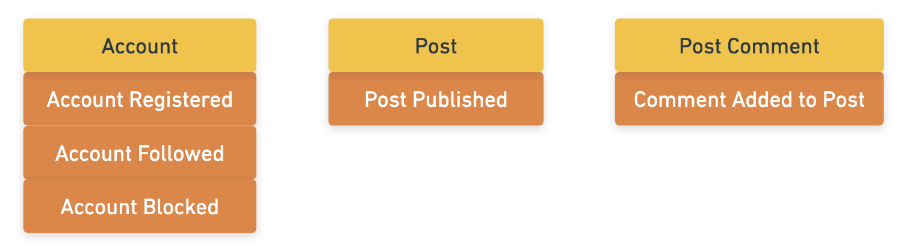

# Entities

[Back to the workshop overview](https://github.com/PensionBee/ddd-workshop#workshop-overview)

## Context

### What is an Entity?

**Entities** represent the concepts which exist in our domain. Every **Entity** must have some kind of ID which uniquely identifies it throughout its lifecycle. An **Entity** can be made up of simple values (attributes), which may change throughout the entity's lifecycle. For example:

```sh
Order # An Entity - even when the attributes of an order change, it's still the same order
    ID # A simple value that uniquely identifies the specific order throughout its lifecycle
    Buyer ID # A simple value that references the 'Buyer' Entity by it's unique ID
    Estimated Delivery Date # A simple value that could change throughout the Order's lifecycle
```

**Entities** can also contain more 'complex' values...

```sh
Order
    ID
    Buyer ID
    Estimated Delivery Date
    Delivery Address # A 'complex' value that could change throughout the Order's lifecycle.
        Number
        Street
        City
        Postcode
```

### Aggregates (i.e. Nested Entities)

An **Aggregate** is essentially a group of closely coupled **Entities** which *need* to change as a single unit for the sake of immediate consistency (similar to "ACID transactions" at the database level). For example:

```sh
Order
    ID
    Buyer ID
    Estimated Delivery Date
    Delivery Address
        Number
        Street
        City
        Postcode
    Order Lines # A collection of 'Order Line' Entities, which are independent of each other but may affect the overall `Order` Entity
        Order Line 1
            ID # Each 'Order Line' has it's own unique ID
            Product ID
            Product Price
            Quantity
            Total Price
        Order Line 2
            ID
            Product ID
            Product Price
            Quantity
            Total Price
```

Here, the `Order` **Entity** is the "root **Entity**" of the `Order` **Aggregate**, the consistency boundary encapsulating every attribute and entity within it.

But why do we need this? Why can't we just model all our **Entities** independently?

Good question! There's absolutely nothing stopping us doing exactly that. But there can be some downsides to this approach...

Let's say we have several business rules centred around an order:

- Spend more than £50 and get speedy delivery on orders
- Buy 5 or more of the same item and get 15% off that item
- Spend more than £100 and get 10% off 'special' items
- Discounts are capped at £50
- Customers with an 'Eco' status pay £1 extra per order line with an 'eco item', to support the environment
- etc.

As the number of business rules increases, it becomes easier for our `Order` and `Order line` **Entities** to get into an inconsistent state and we might end up with some messy bugs if we treat each **Entity** as an independent unit. To reduce the chances of this happening, we can group these **Entities** together and treat them as a single unit when anything about those **Entities** changes. This makes it easier to enforce business rules across all relevant **Entities**.

Note that, from a code perspective, it's often easier to deal with standalone **Entities** than complex **Aggregates**. In many cases, it's reasonable to design standalone **Entities**. But there are certainly cases where the benefits of grouping **Entities** together will be worth it.

### Abstract Entities

**Entities** all fall somewhere on an scale of abstraction. Some are very easy to reason about and visualise in the physical world (e.g. a `Customer` **Entity**) whereas others are more difficult reason about and visualise, and therefore require more exploration of the domain to discover.

For example, in a banking domain, we might choose to model the process of moving money between two `Bank Account` **Entities** using a seaprate `Transaction` **Entity**, which might look something like this:

```sh
Transaction
    ID
    Status
    Amount
    Sending Account ID
    Receiving Account ID
```

The alternative might be to just add and subtract money from the relevant `Account` **Entities**, which *could* work except that you start seeing `Accounts` with more or less money than they should have because the change in balance of one `Account` was successful, while the other was unsuccessful.

This is why EventStorming is such an important tool in DDD. This kind of domain discovery can take a little time and energy, which isn't going to happen if you dive into coding or designing database tables. Getting the important stuff out of our heads and onto an EventStorming diagram makes it easy for us to start thinking about these kinds of things sooner rather than later, giving us the best chance of making good decision when it comes to **Entity** design.

### Parsing

The process of taking unvalidated data as input and outputing valid (and potentially transformed) data is known as parsing. Failure to validate/transform input data usually results in an error being thrown or returned.

We can create parsers for our **Entities** to ensure they are always in a valid state. This is an extremely powerful way to prevent all sorts of edge case bugs and improve data integrity over the lifetime of the system.

As an example, let's say we have a `/register` API endpoint which a client (web app, mobile app, etc.) sends the following data to:

```json
{
  "email": "abc123@test.com",
  "password": "password1",
  "address": {
    "addressLine1": "1",
    "addressLine2": null,
    "postcode": "1234 567"
  }
}
```

Internally, we'll process this request as a **Command**, resulting in an `Account Registered` **Event** and an `Account` **Entity** being created if the request is successful.

But let's imagine our `Account` **Entity** should look like the following:

```ts
type Account = {
  id: string; // Required - should be a uuid - generated internally
  email: string; // Required - should be in a valid email format
  password: string; // Required - should contain between 8 and 64 characters
  address: {
    addressLine1: string; // Required
    addressLine2: string; // Required
    addressLine3: string | null; // Optional
    city: string; // Required
    postcode: string; // Required - should be in the format AB11 1AB
  } // Required
}
```

When we create a new `Account` **Entity** in our system (or update one), we should always parse the data being used before persisting it.

However, note that TypeScript types aren't great at capturing all the validation logic belongs to the `Account` **Entity**. While types are a great tool for improving codebase understanding and help us write high-quality code, they can't do everything, especially since they're usually stripped out at runtime.

Enter `zod`, an incredible TypeScript-first utility library which we'll use throughout the rest of the workshop. Using `zod` means we don't have to roll our own low-level validation functionality (which is a lot more complex than you might think). Here's how the above `Account` **Entity** might be represented using a `zod` schema:

```ts
const accountSchema = z.object({
  id: z.string().uuid(),
  email: z.string().email(),
  password: z.string().min(8).max(64),
  address: z.object({
    addressLine1: z.string();
    addressLine2: z.string(),
    addressLine3: z.string().nullish().default(null)
    city: z.string(),
    postcode: z.string().regex(/^...$/),
  })
})
```

Notice how easy it is to capture validation rules for an `Account` which doubles as documentation that can't go out of sync. This is the pinnacle of "living documentation"! Goodbye bugs - hello clarity!

Best of all, `zod` provides a `z.infer` TypeScript utility which can infer the specific TypeScript types corresponding with a schema, giving us the best of both worlds in terms of runtime validation and compile-time type safety. Here's all you need to know to get started...

```ts
type Account = z.infer<typeof accountSchema> 
```

🤯🤯🤯

## Additional Resources

- [Domain-Driven Design: Entities, values, and How To Distinguish Them (5 minutes read)](https://blog.jannikwempe.com/domain-driven-design-entities-value-objects)
- [Entities & values (2.5 minute video)](https://www.youtube.com/watch?v=r8q5DD9rd3M)
- [The One Question To Haunt Everyone: What is a DDD Aggregate? (25 minute video)](https://www.youtube.com/watch?v=zlFqjD2LKlE)

## Codebase Structure

At this point, it's worth touching upon the directory structure we're using. We currently have 2 **Bounded Contexts**, `Accounts` and `Posts`, which live in the **src/contexts/** directory. Each of these have the same directory structure inside (most of which is empty for the moment):

- **core/**: This is our "application core", where we'll model our **Entities** and build out **Command Handlers** exposing our system's capabilities (i.e. publishing a post or following an account). We want to keep the code in this layer focused on business concepts and business rules.
  - *If you're familiar with onion/clean/hexagonal/ports-and-adapters architecture, this layer is essentially the "domain" and "application" layers squashed into one for simplicity.*
- **infra/**: Short for "infrastructure" - this is where we'll write the code which allows our system to interact with the external world (e.g. accessing databases and the file system or making HTTP calls to external systems).
- **interface/**: This is the opposite of infrastructure - a way for the outside world to make use of the functionality exposed from our application core. This is where we'll write lightweight API code.

## The Practical Bit

*Note: each section of the workshop builds upon the previous one. You can check your solutions against the code found in the next section.*

Let's have another look at the EventStorming diagram we're using to guide the code we write.


We have 3 entities at play: `Account`, `Post` and `Post Comment`. Let's turn those into code.

When we model **Entities** in our software, we're trying to capture the essential attributes (and relationships) which define that domain concept. To do this, it can be helpful to look at all of the events associated with each entity and evaluate how each event impacts it. How can those changes be captured on the entities themself. For example:



### Part 1: Modelling a Post

1. In **src/contexts/posts/core/entities/post.ts**, complete the `postSchema` using [zod](https://github.com/colinhacks/zod).

This schema now serves as a source-of-truth representation of what a `Post` **Entity** is within *this* **Bounded Context** (we might have different definitions of this entity in other **Bounded Contexts** in the future). 

Note that we have a `Post` type being generated using `z.infer` and we also have a `parsePost` function. The latter simply calls `postSchema.parse` (native zod functionality) under the hood but provides us with a cleaner way to parse `Posts` from other parse of our code. Also, if we ever decide to move away from using `zod` in the future, we only need to change the `parsePost` function itself since no zod functionality has leaked into the rest of our system.

2. In **src/contexts/posts/core/entities/post.spec.ts**, complete the test suite to ensure the schema captures `Post` validation rules and that the `parsePost` function works as expected.

**Note that this test suite can be run via `npm test src/contexts/posts/core/entities/post.spec.ts` and all test suites can be run via `npm test`.**

### Part 2: Modelling a Post Comment

1. In **src/contexts/posts/core/entities/postComment.ts**, define the `PostComment` type, `postCommentSchema` and `parsePostComment` function. Ensure the `PostComment` type and the `parsePostComment` function are exported so they can be used in other areas of the codebase.
2. In **src/contexts/posts/core/entities/postComment.spec.ts**, complete the test suite to ensure the schema captures `PostComment` validation rules and that the `parsePostComment` function works as expected.

### Part 3: Updating the Account model to facilitate followers and blocked Accounts

We already have an existing `Account` **Entity** in our `Accounts` bounded context but it doesn't currently capture any details about followers or blocked `Accounts`. Let's rectify that...

1. In **src/contexts/accounts/core/entities/account.ts**, update `accountSchema` to include a `followers` attribute which holds information about all the followers of an account. You're free to model `followers` as simple/complex values or as **Entities** in their own right, turning this into an `Account` **Aggregate**. 
2. In **src/contexts/accounts/core/entities/account.ts**, update `accountSchema` to include a `blockedAccounts` attribute which holds information about all the accounts an account has blocked. As above, you're free to model `blockedAccounts` as simple/complex values or as **Entities** in their own right.
3. In **src/contexts/accounts/core/entities/account.spec.ts**, complete the test suite to ensure the schema captures `Account` validation rules and that the `parseAccount` function works as expected.

## Questions Worth Pondering

**Note: There are no straightforward answers to these questions - everything comes with a trade-off.**

- What value are we getting from our parser tests? Do they have value here?
- If you're answer to the above was "no" (which is neither right or wrong), are there situations where theses tests *would* be valuable?

## Next Up

That's us finished with the **Entities** section. Next up, [repositories](https://github.com/PensionBee/ddd-workshop/tree/04-repositories)
