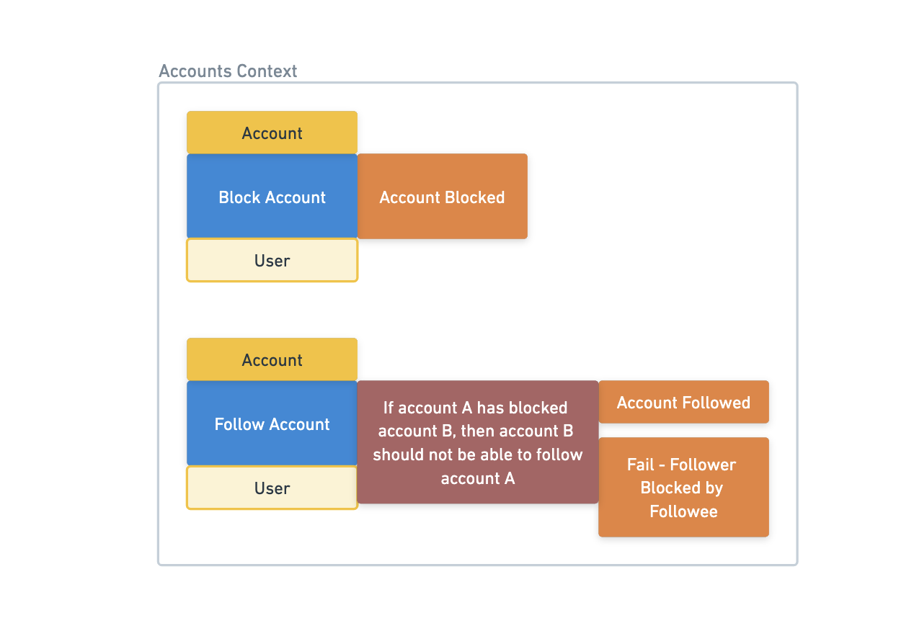

# Command Handlers & Derivers

[Back to the workshop overview](https://github.com/PensionBee/ddd-workshop#ddd-workshop-overview)

## Context

In the [EventStorming](https://github.com/PensionBee/ddd-workshop/tree/eventstorming) section of the workshop, we used events, commands and entities to design a solution for the problems our business is currently focused on...


We've already modelled our entities as code in the [Values, Entities & Parsers](https://github.com/PensionBee/ddd-workshop/tree/values-entities-and-parsers) section and built a mechanism for fetching and persisting entities in the [Repositories & Persistence](https://github.com/PensionBee/ddd-workshop/tree/values-entities-and-parsers) section. In this section, we're going turn our command and event blocks into code...

### Command Payloads

We've already identifies commands as an intent to change the state of our system but let's complete the picture by acknowledging that most commands are only meaningful when there's some relevant data attached (often referred to as a 'payload'). For example:

```ts
type InitiateInvoicePaymentCommand = {
  type: "INITIATE_INVOICE_PAYMENT",
  payload: {
    invoiceId: string,
    amountUSD: number,
    paymentCurrency: "GBP" | "EUR" | "USD",
    paymentCardId: string
  }
}
```

Without the payload, this command would be meaningless to our system.

### Command Handlers

A command handler is a function which processes a specific command. There's no universal definition of what a command handler is but, for this workshop, let's say that all command handlers must do the following:

1. Validate the incoming command data
2. Use the command data to fetch relevant system 'state', i.e. existing entities necessary to process the command
3. Use the command data and fetched state to 'derive an outcome'
4. Update the state of the system (for success outcomes)

Note that an 'outcome' can be one of 2 categories:

- A success event (captures a change in the system)
- A fail event (captures a business rule failure - not a technical failure)

Let's visualise this four step process with an example:

```ts
// COMMAND DATA SCHEMA
// --------------------
// Describes the expected command data
const commandDataSchema = z.object({
  invoiceId: z.number(),
  paymentCardId: z.number()
  // ...
})

// DERIVER
// -------
// Contain all the business logic in one place - we'll dive into this below.
const deriveOutcome = (data, state) => {
  // ...
}

// COMMAND HANDLER
// ---------------
// Processes the 'pay invoice' command
const handlePayInvoice = async (commandData: Record<string, unknown>) => {
  // STEP 1: Validate the incoming command data
  const data = commandDataSchema.parse(commandData)

  // STEP 2: Use the command data to fetch relevant system 'state', i.e. existing entities necessary to process the command
  const state = {
    invoice: await invoiceRepository.findById(data.invoiceId), // Returns an invoice or null
    paymentCard: await paymentCardRepository.findById(data.paymentCardId) // Returns a payment card or null
  }

  // We can throw here if the state is invalid.
  if (!state.invoice) {
    throw new Error("Invoice not found")
  }
  if (!state.paymentCard) {
    throw new Error("Payment card not found")
  }

  // STEP 3: Use the command data and fetched state to 'derive an outcome'
  const outcome = deriveOutcome(data, state)

  // STEP 4: Update the state of the system (for success outcomes)
  switch (outcome.type) {
    case 'INVOICE_PAYMENT_INITIATED':
      await invoiceRepository.save({
        ...state.invoice, // Spread the existing invoice
        status: outcome.payload.status, // Update the status using the outcome payload, e.g. "Awaiting Payment Completion"
      })
      break
  }

  return outcome
}
```

That's a lot to unpack but it will make more sense once you've gone through 'The Practical Bit' below - come back and reference this example where useful.

### Outcomes (Events)

Outcomes (events) capture information about state changes in our system as well as change attempts which failed.

We can generalise an event like so:

```ts
type Event = {
  type: Uppercase<string>, // The 'name' of the event
  payload: Record<string, unknown> // Important data related to the event
}
```

Here's an example of a success event:

```ts
type InvoicePaymentPendingEvent = {
  type: "INVOICE_PAYMENT_INITIATED",
  payload: {
    invoiceId: string,
    status: "Awaiting Payment Completion",
    amountUSD: number,
    paymentCurrency: "GBP" | "EUR" | "USD",
    paymentCardId: string
  }
}
```

Here are two examples of fail events (as a union):

```ts
type InvoicePaymentFailedEvent = {
  type: "INVOICE_PAYMENT_FAILED/INVOICE_IN_COOL_OFF_PERIOD",
  payload: {
    invoiceId: string,
    hoursUntilCoolOffPeriodEnds: number
  }
} | {
  type: "INVOICE_PAYMENT_FAILED/INVOICE_ALREADY_PAID",
  payload: {
    invoiceId: string,
  }
}
```

### Derivers

Derivers are where we handle the business rules which govern our domain, for example: `Invoices cannot be paid within a 'cool off' period, which is currently the first 48 hours after being issued`.

*Note: Business rules are where a large part of the *essential complexity* in software systems comes from, i.e. the stuff we can't easily simplify or improve because the world is inherintly complex. This is in contrast to *accidental complexity*, which is pretty much just technical debt.*

Derivers generally take data and state as arguments and return an outcome (an success event or a fail event). We can visualise this process like so:


Derivers are simple functions which carry out a set of business logic checks one by one. If any check fails, the relevant fail event is returned. If all checks pass, a success event is returned (sometimes additional business logic is checked to identify which of several success events should be returned).

Here's an example deriver which we could use in the command handler code example above:

```ts
const derivePayInvoiceOutcome = (data, state) => {
  const { amountUSD, paymentCurrency } = data 
  const { invoice, paymentCard } = state

  if (invoice.status === "Paid") {
    return {
      type: "INVOICE_PAYMENT_FAILED/INVOICE_ALREADY_PAID",
      payload: {
        invoiceId: invoice.id
      }
    }
  }

  const now = new Date()
  const hoursSinceIssued = getDifferenceInHours(invoice.issuedAt, now)
  if (hoursSinceIssued < 48) {
    return {
      type: "INVOICE_PAYMENT_FAILED/INVOICE_IN_COOL_OFF_PERIOD",
      payload: {
        invoiceId: invoice.id,
        hoursUntilCoolOffPeriodEnds: 48 - hoursSinceIssued
      }
    }
  }

  // Other business rule checks go here

  return {
    type: 'INVOICE_PAYMENT_INITIATED',
    payload: {
      invoiceId: invoice.id,
      status: "Awaiting Payment Completion",
      amountUSD: amountUSD,
      paymentCurrency: paymentCurrency
      paymentCardId: paymentCard.id
    }
  }
}
```

## Resources

Feel free to check these out before or after completing 'The Practical Bit' below.

- [Functional Domain Driven Design: Simplified (15 minute read - well worth the time!)](https://antman-does-software.com/functional-domain-driven-design-simplified)
- [Functional Event Sourcing Decider (15 minute read - get's gnarlier the further you read)](https://thinkbeforecoding.com/post/2021/12/17/functional-event-sourcing-decider)

## The Practical Bit

*Note: each section of the workshop builds upon the previous one. You can check your solutions against the code found in the next section.*

### Part 1: Creating a Post

For now, let's only focus on success outcomes to get used to the general pattern, i.e. assume `Post Created` is the only possible outcome.

In **src/contexts/posts/core/commands/createPost.handler.ts**:

**Step 1: Validate the incoming command data...**

- Complete the `commandDataSchema` using zod.
  - *Hint: think about what data is necessary for creating a post.*
  - *Hint: It will likely be similar to the `postSchema` we defined previously. This won't always be the case though, especially when a command operates on an existing entity.*

**Step 2: Use the command data to fetch relevant system 'state'...**

- Complete the `State` type, defining the entities, if any, which are required to process this command.
  - *Hint: Do we need to make sure the `Account` entity exists before we create a post? i.e. is that something we expect to exist before we even process business rules.*
- Complete the `fetchState` function, using the repositories we built previously to fetch the state we need.

**Step 3: Use the command data and fetched state to 'derive an outcome'...**

- Complete the `Outcome` type, defining the possible outcomes using the structure outlined above.
  - *Hint: Remember, for now, we only care about the `Post Created` outcome.*
- Complete the `deriveOutcome` function, generating and return the possible outcomes.
  - *Hint: Since the payload for a successful outcome needs to capture the state change in the system, we'll likely need to generate a IDs in our deriver when new entities are created (unless you force calling code to provide the ID as part of the command data). In a production system, you'd probably want to use something like UUIDs or Nano IDs but feel free to use something like `Math.random()` for ease here.*

**Step 4: For success outcomes, update the state of the system...**

- Complete the `updateState` function - add a switch statement (or use 'if' logic), creating/modifying and persisting entities via repositories for any successful outcome.

**Step 5: Adding Tests...**

Finally, let's write some tests for this command handler. This might seem a bit daunting at first but we've actually just made testing at a feature level pretty simple by creating a standalone function, which is independent of any real infrastructure or API concerns and fully encapsulates a atomic change within our system, including all the relevant business rules for that change.

In **src/contexts/posts/core/commandHandlers/createPost.handler.spec.ts**, let's use the 'Arrange - Act - Assert' testing approach:

- (ARRANGE) Set up the initial state by adding an account to the in-memory account store via the `accountRepository.save` method.
- (ACT) Trigger `handleCreatePost` with the relevant command data.
  - *Hint: the account ID should be the ID of the account we just created.*
- (ASSERT) Check that the command handler outcome and payload is as expected.
- (ASSERT) Check that a `Post` entity was correctly persisted.
  - *Hint: You can use the `postRepository.getById` method*

### Part 2: Commenting on a Post

In **src/contexts/posts/core/commandHandlers/CommentOnPost.handler.ts**, complete the command handler functions like we did in part 1 (Again, let's only focus on success outcomes to reinforce the general pattern, i.e. assume `Comment Added to Post` is the only outcome.)

In **src/contexts/posts/core/commandHandlers/CommentOnPost.handler.spec.ts**, complete the command handler tests like we did in part 1.

### Part 3: Following an Account

Just as you're about to start writing the `Follow Account` handler, the CEO pulls you aside...

> Hey, I was just thinking that my mum might try to follow my account after we get the MVP out there. I love her and all but I just can't have her all up in my social media business, you know? Anyway, if we can stop accounts from following accounts that have blocked them, that would be great.

We now have a new business rule we need to handle: `If Account A has blocked Account B, then Account B should not be able to follow Account A`.

An additional business rule usually results in an additional outcome that our deriver needs to handle. If we wanted, we could capture this on our EventStorming diagram. For example:



We can ignore the `Block Account` section of the diagram for now and focus only the `Follow Account` section. To do this though, we'll need to modify our `Account` entity to capture 'account blocking' information.

*note that we could choose to model 'account blocking' information as a separate entity - something descriptive like a `Blocked Account` entity could work. For now though, let's just add that information to the `Account` entity directly, similarly to how we added 'account following' information earlier in the workshop.*

In **src/contexts/accounts/core/entities/account.ts**:

- Add a `blockedAccounts` attribute.
  - *Hint: Feel free to use an array of account IDs rather than a dedicated `Blocked Account` entity. This way our design stays simple until we know we need the extra complexity.*

In **src/contexts/accounts/core/commands/followAccount.handler.ts**, complete the command handler functions like we did in parts 1 and 2

In **src/contexts/accounts/core/commandHandlers/followAccount.handler.spec.ts**, complete the command handler tests like we did in parts 1 and 2.
  *Hint: There should be a test for each outcome and in some tests we may need to asser that entities were NOT persisted.*

### Part 4: Blocking an Account

In **src/contexts/accounts/core/commands/blockAccount.handler.ts**, complete the command handler functions like we did in parts 1, 2 and 3

In **src/contexts/accounts/core/commandHandlers/blockAccount.handler.spec.ts**, complete the command handler tests like we did in parts 1, 2 and 3.

## Questions Worth Pondering

- Which kind of tests (unit, integration, e2e, regression, acceptance, etc.) are command handler tests?
- What value do we get from writing command handler tests?
- What kind of things do we NOT want to test in command handler tests? Why?
