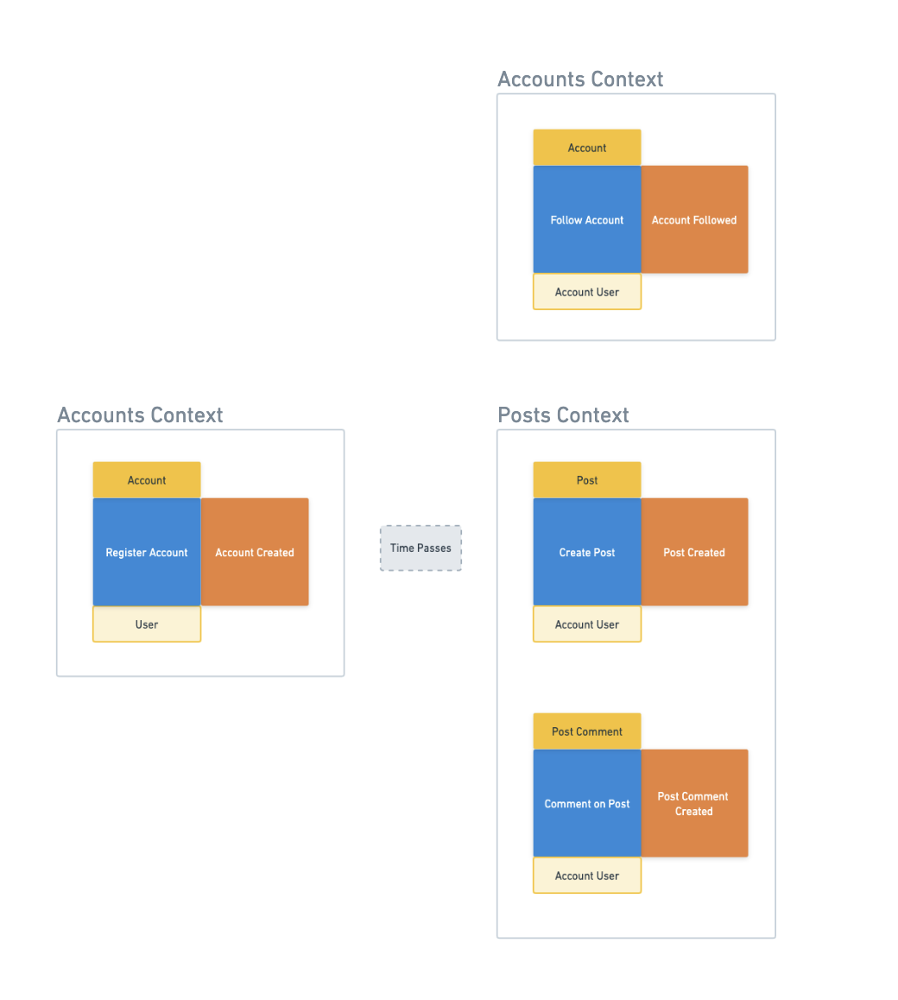
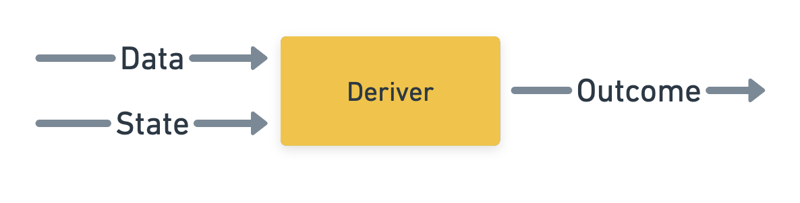

# Command Handlers & Derivers

[Back to the workshop overview](https://github.com/PensionBee/ddd-workshop#ddd-workshop-overview)

## Context

In the [EventStorming](https://github.com/PensionBee/ddd-workshop/tree/eventstorming) section of the workshop, we used events, commands and entities to design a solution for the problems our business is currently focused on...



We've already modelled our entities as code in the [Values, Entities & Parsers](https://github.com/PensionBee/ddd-workshop/tree/values-entities-and-parsers) section and built a mechanism for fetching and persisting entities in the [Repositories & Persistence](https://github.com/PensionBee/ddd-workshop/tree/values-entities-and-parsers) section. In this section, we're going turn our command and event blocks into code...

### Command Payloads

We've already identifies commands as an intent to change the state of our system but let's complete the picture by acknowledging that most commands are only meaningful when there's some relevant data attached (often referred to as a 'payload'). For example:

```ts
type PayInvoiceCommand = {
  type: "PAY_INVOICE",
  payload: {
    invoiceId: string,
    paymentCurrency: "GBP" | "EUR" | "USD",
    amount: string,
    paymentDetails: {
      accountNumber: number,
      sortCode: number,
    }
  }
}
```

Without the payload, this command would be meaningless to our system.

### Command Handlers

A command handler is a function (or class if you're working in OOP-land) which processes a specific command. There are many ways we could generalise a command handler but for this workshop, let's say that all command handlers must do the following:

1. Validate the incoming command data
2. Use the command data to fetch relevant system 'state', i.e. existing entities and data necessary to process the command
3. Use the command data and fetched state to 'derive an outcome'
4. For 'success outcomes', update the state of the system

Note that an 'outcome' can be one of 3 categories:

- An event (captures a successful change in the system)
- An error (a business error - not a technical error)
- A no-op (stands for "no operation" - nothing about the system needs to change)

You could also argue that all outcomes are just events (just not always successful ones) that fall into the following categories:

- A success event
- An error event
- A no-op event

But that's getting into details and potential conflict territory prematurely...

Let's take a step back and visualise this four step process with an example:

```ts
// A zod schema describing the expected command data
const commandDataSchema = z.object({
  ...
})

// A command handler which processes the 'pay invoice' command
const handlePayInvoice = async (commandData: Record<string, unknown>) => {
  // STEP 1: Validate the incoming command data
  const data = commandDataSchema.parse(commandData)

  // STEP 2: Use the command data to fetch relevant system 'state', i.e. existing entities and data necessary to process the command
  const state = {
    invoice: await invoiceRepository.findById(data.invoiceId),
  }

  // STEP 3: Use the command data and fetched state to 'derive an outcome'
  const outcome = deriveOutcome(data, state) // 'deriveOutcome' captures all the business logic in one place

  // STEP 4: For 'success outcomes', update the state of the system
  switch (outcome.type) {
    case 'INVOICE_PAID': // A success outcome: The full invoice balance was paid off
      await basketRepository.save({
        ...state.invoice, // The existing invoice
        status: outcome.payload.status, // Probably something like "Paid"
        remainingBalance: outcome.payload.remainingBalance, // Likely zero
      })
      break
    case 'INVOICE_PARTIALLY_PAID': // A success outcome: Some of the outstanding invoice balance was paid off
      await basketRepository.save({
        ...state.invoice, // The existing invoice
        status: outcome.payload.status, // Probably something like "Partially Paid"
        remainingBalance: outcome.payload.remainingBalance, // Likely non-zero
      })
      break
  }

  return outcome
}
```

That's a lot to unpack but it will make more sense once you've gone through 'The Practical Bit' below.

Before we get to that though, let's dig into derivers a little more...

### Derivers

In step 3 above, `Use the command data and state to 'derive an outcome'`, we want to enforce all the business rules relevant for the specific command being handled, such as `Invoices cannot be paid within a 'cool off' period (the first 48 hours after being issued)`.

This is where a large part of the *essential complexity* in our code comes from, i.e. the stuff we can't easily simplify or improve (as opposed to *accidental complexity*, which is essentially technical debt), so it can be useful to extract it to an independent function and let it grow organically over time as business rules change.

As we seen above, derivers generally take data and state as arguments and return an outcome (an event, error or no-op). We can visualise this process like so:



Let's look at one approach to modelling / structuring outcomes generally:

```ts
type Outcome = {
  type: Uppercase<string> | `ERROR/${Uppercase<string>}` | `NO_OP/${Uppercase<string>}`,
  payload: Record<string, unknown>
}
```

Here's are two examples of event outcomes:

```ts
type InvoicePaidEvent = {
  type: "INVOICE_PAID",
  payload: {
    invoiceId: string,
    remainingBalanceUSD: 0,
    status: "Pai"'
  } // Important data related to the event is captured in the payload
}
```

```ts
type InvoicePartiallyPaidEvent = {
  type: "INVOICE_PARTIALLY_PAID",
  payload: {
    invoiceId: string,
    remainingBalanceUSD: 34,
    status: "Partially Pai"'
  }  // Important data related to the event is captured in the payload
}
```

An error outcome might look like this:

```ts
type InvoiceInCoolOffPeriodError = {
  type: "ERROR/INVOICE_IN_COOL_OFF_PERIOD",
  payload: {
    invoiceId: string,
    daysRemaining: number
  }  // Important data related to the error is captured in the payload
}
```

An no-op outcome might look like this:

```ts
type InvoiceAlreadyPaidNoOp = {
  type: "NO_OP/INVOICE_ALREADY_PAID",
  payload: {
    invoiceId: string,
  }  // Important data related to the no-op is captured in the payload
}
```

Derivers can simply be functions which carry out a set of business logic checks. If any check fails, the relevant error or no-op outcome is returned. If all checks pass, additional business logic can be checked to identify which event outcome should be returned. Here's an example deriver which we could use in the command handler code example above.

```ts
const derivePayInvoiceOutcome = (data, state) => {
  const { amount, currency } = data
  const { invoice } = state

  if (invoice.status === "Paid") {
    return {
      type: "NO_OP/INVOICE_ALREADY_PAID",
      payload: {
        ...
      }
    }
  }

  const now = new Date()
  const hoursSinceIssued = getDifferenceInHours(invoice.issuedAt, now)
  if (hoursSinceIssued < 48) {
    return {
      type: "ERROR/INVOICE_IN_COOL_OFF_PERIOD",
      payload: {
        ...
      }
    }
  }

  const amountInUSD = convertCurrencyToUSD(amount, currency)
  if (amountInUSD < invoice.remainingBalanceUSD) {
    return {
      type: 'INVOICE_PARTIALLY_PAID',
      payload: {
        ...
      }
    }
  }

  return {
      type: 'INVOICE_PAID',
      payload: {
        ...
      }
    }
}
```

## Resources

Feel free to check these out before or after completing 'The Practical Bit' below.

- [Functional Domain Driven Design: Simplified (15 minute read - well worth the time!)](https://antman-does-software.com/functional-domain-driven-design-simplified)
- [Functional Event Sourcing Decider (15 minute read - get's gnarlier the further you read)](https://thinkbeforecoding.com/post/2021/12/17/functional-event-sourcing-decider)

## The Practical Bit

*Note: each section of the workshop builds upon the previous one. You can check your solutions against the code found in the next section.*

### Part 1: Creating a Post

In **src/contexts/posts/core/commands/createPost.handler**:

- Step 1: Validate the incoming command data:
  - Complete the `commandDataSchema` using zod - think about what data is necessary for posting a comment. *Hint: It will likely be similar to the `postSchema` we defined previously. This won't always be the case though.*
- Step 2: Use the command data to fetch relevant system 'state':
  - Update the `fetchState` function - use the repositories we built previously to fetch the state we need to properly process this command.
- Step 3: Use the command data and fetched state to 'derive an outcome':
  - Update the `deriveOutcome` function - create and return the necessary outcome(s) for this command, using the format defined above. *Hint: Since the payload for an event outcome is intended to capture the state change in the system, we need to generate IDs as part of the payload for any new entities we create. Feel free to use Math.random() or any other mechanism to achieve this, but remember our entity IDs have restrictions on what they start with.*
- Step 4: For 'success outcomes', update the state of the system:
  - Update the `updateState` function - complete the switch statement, creating/modifying and persisting entities via repositories for any successful outcome.

Finally, let's write some tests for this command handler. This might seem a bit daunting at first but we've actually just made testing at a feature level pretty simple by creating a standalone function, `handleCreatePost`, which is independent of any infrastructure or API concerns and fully encapsulates a single, logical, manageable change within our system, including all the business rules we should be testing.

- In **src/contexts/posts/core/commandHandlers/createPost.handler.spec.ts**:
  - Write tests using the 'Arrange - Act - Assert' testing approach:
    - Arrange: Set up the initial state (if any) required for the test using the in-memory repositories we built previously.
    - Act: Trigger `handleCreatePost` with the relevant command data.
    - Assert:
      - Check that the command handler outcome is as expected.
      - Check that entities were correctly persisted or not persisted, depending on the test.

### Part 2: Commenting on a Post

Repeat the above steps but for the `Comment on Post` command. You'll need to create the following files:

- **src/contexts/posts/core/commandHandlers/CommentOnPost.handler.ts**:
- **src/contexts/posts/core/commandHandlers/CommentOnPost.handler.spec.ts**:

### Part 3: Following an Account + Test-Driven Development (TDD)

Repeat the above steps but for the `Follow Account` command but this time let's incorporate Test-Driven Development (TDD) principles into our workflow, by flipping the process on it's head and writing our tests ***before*** we write the code. You'll need to create the following files:

- **src/contexts/posts/core/commandHandlers/followAccount.handler.spec.ts**:
- **src/contexts/posts/core/commandHandlers/followAccount.handler.ts**:

## Questions Worth Pondering

- Which kind of tests (unit, integration, e2e, regression, acceptance, etc.) are command handler tests?
- How can we write command handler tests efficiently?
- What value do we get from writing command handler tests?
