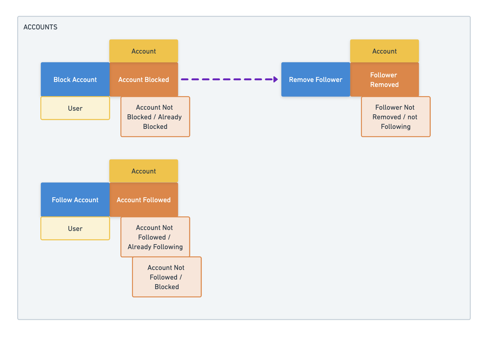

# Policies

[Back to the workshop overview](https://github.com/PensionBee/ddd-workshop#workshop-overview)

## Context

We now have the foundational building blocks to start moving into event-driven territory. Event-driven systems are exactly what you're imaginging right now! An **Event** occurs and, as a result, something happens. It's as simple as that (not to say that event-driven systems are simple - they generally carry a lot of technical complexity - but the principle is simple).

"But we don't have anything like that" you might say. And you'd be dead wrong if you did. The CEO shouts your name just as you're about to take a sip of coffee (it goes all down your white tee, of course).

> "That's my mum just off the phone telling me she thought my dinner last night looked great!", they yell.
>
> "Oh, what did you make?", you ask politely.
>
> "Lasagne, but that's not the point. The point is that I blocked her on Tuesday but she's still seeing my stuff."
>
> "Ohh, right. Whoops..."

We've failed to account for the requirement that blocking an account should automatically remove that follower from your account. Let's rectify that. But not in the code, that'd be jumping the gun a little. Let's head back over to our EventStorming diagram to sanity check that what we're doing makes sense in the wider context. We might discover various different ways to approach this problem and we can do that 'cheaply' on our diagram.

Here's how it might look after adding in the new requirement:

Three things to note:

1. We have a new **Command** with two possible **Events** resulting from it
2. We've connected the `Account Blocked` **Event** to the `Remove Follower` **Command** with an arrow (use whatever color and style you like).
3. `Remove Follower` has no **Actor** associated with it. Since this is an automated process, no one has to explicitly take any actions.

Point 2 is what's known as a **Policy**. It's business logic in the form "if this then that" or "when this happens do that". In our case we have:

> When `Account Blocked` then `Remove Follower`

Easy peelers, right? Now we just have to turn it into code...

### Publish / Subscribe

Let's lean on the long standing "Publish / Subscribe" pattern, which is conceptually pretty simple. Subscribers specify the **Events** they care about and when that **Event** is published on a message bus, the subscriber is notified so it can do whatever it needs to do.

To get this working in practice, we've added a 5th step to all of our command handlers, which calls a `publishEvent` utility function (defined in **src/shared/infra/pubSub.ts**) with whichever **Event** was returned from the `deriveEvent` function. Under the hood, `publishEvent` just uses Node's `EventEmitter` class.

We've also added a `configurePolicy` utility in **src/shared/core/policies.ts**, which hooks up policies to work with the same `EventEmitter` instance that `publishEvent` uses. With this, we can now configure which **Commands** we want to run when specific **Events** occur.

## Additional Resources

- TODO: Add some resources

## The Practical Bit

Let's start out by adding our new command handler and it's associated **Events**.

1. In **src/contexts/accounts/core/events/account.events.ts**, add representations of the new **Events**.
2. In **src/contexts/accounts/core/commandHandlers/removeFollower.handler.ts**, complete the command handler.
3. In **src/contexts/accounts/core/commandHandlers/removeFollower.handler.spec.ts**, complete the test suite.

Next, we need to configure the policy.

4. In **src/contexts/accounts/core/policies.ts**, update the three "update me" placeholders in the `configurePolicy` function call by...

**a)** passing in the `Account Blocked` **Event** type as the "type argument" (inside the angled brackets)

**b)** modifying the `event` value to be the type (name) of the **Event** we care about

**c)** updating the "action name" to represent the action we're taking.

5. Next, complete the the action function by calling the `handleRemoveFollower` function we just created. Note that we can access the payload of the **Event** that triggered the action in order to achieve this.

That's it, we're pretty much done. Now all we'd need to do is call `configureAccountPolicies` as part of this service's setup code and our policy would be up and running.

In fact, go ahead and add `configureAccountPolicies()` near the top of **src/contexts/accounts/core/commandHandlers/blockAccount.handler.spec.ts** and run that test suite. You should see something like this in the terminal:

> REMOVE_FOLLOWER action executed successfully in response to ACCOUNT_BLOCKED event

We now have enough knowledge to start building out much more complex event-driven systems. This comes with challenges of it's own but that's a trade-off that's often worth accepting given we can now write highly testable, atomic command handlers.

Remember that you can explore complex event-driven systems much more effectively in an EventStorming session than you can by writing code. Now that you've seen how easy it is to convert EventStorming diagrams into code, use it to your advantage as often as you can.

## Next Up

That's us finished with the policies section. Check out the [final solutions](https://github.com/PensionBee/ddd-workshop/tree/final)
