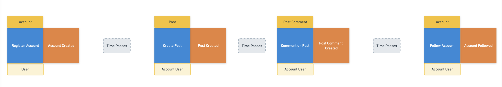
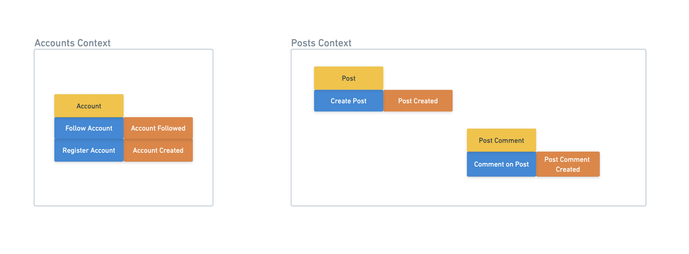
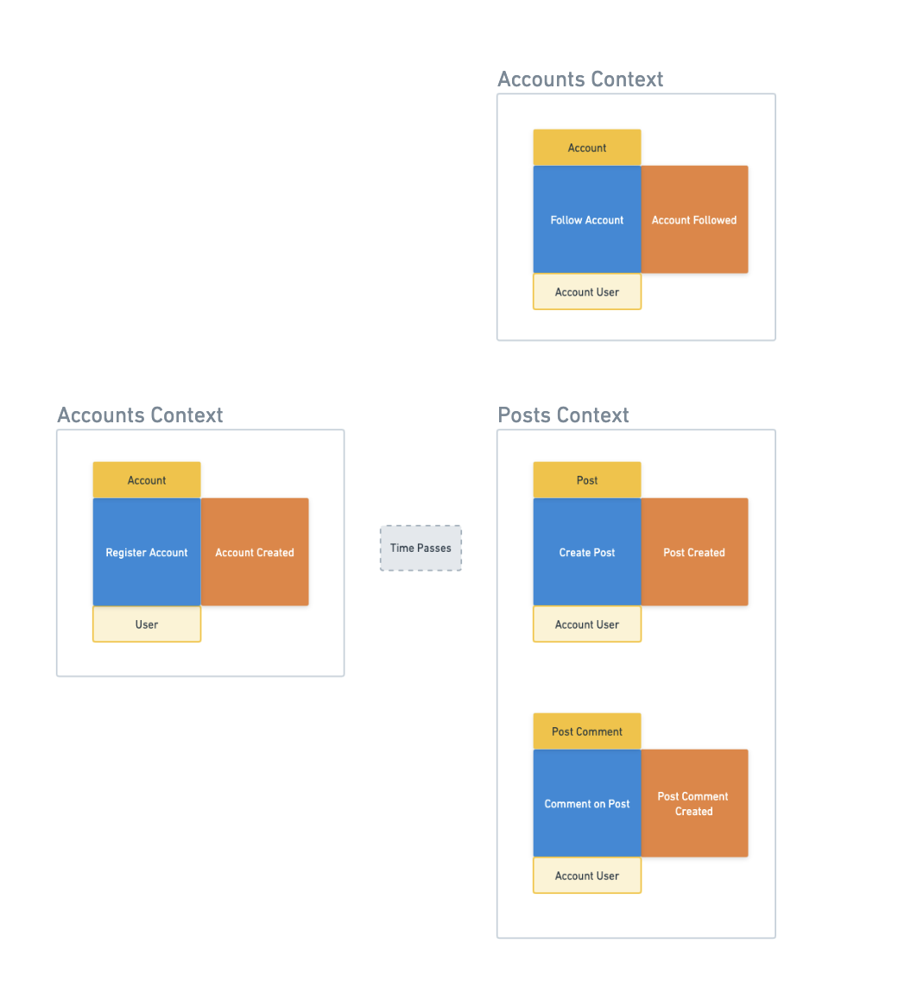

# EventStorming Solutions

[Back to the workshop overview](https://github.com/PensionBee/ddd-workshop#ddd-workshop-overview)

**DO NOT** treat the following diagrams as definitive solutions to the EventStorming exercise! They are potentially naive (on purpose), which we'll use to faciliate discussions around entity design in the next section, especially around the `Account` entity associated with the `Follow Account` command (hint: maybe a separate `Subscription`, `Follower`, `Follow` or `Connection` entity would be better?).

## EventStorming Timeline

## Bounded Context Groups

## EventStorming Timeline with Bounded Contexts

## Questions Worth Pondering

- Is `Account` the best choice of entity for the `Follow Account` command?
- Given the following statement: `Posts are written by authors`, is our EventStorming diagram accurate?
