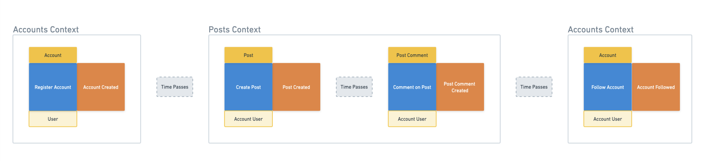
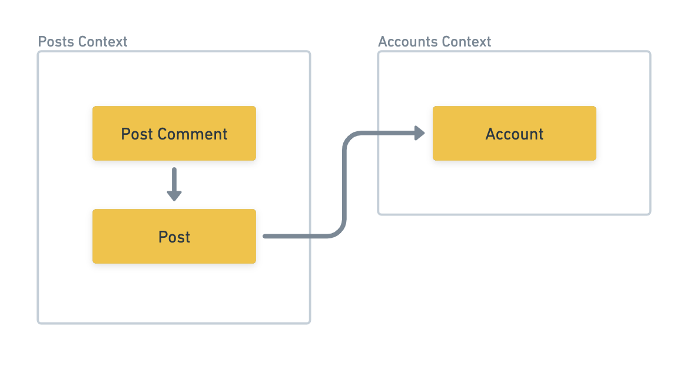

# DDD Workshop - EventStorming Solutions

[Back to the workshop overview](https://github.com/PensionBee/ddd-workshop#workshop-overview)

*Do NOT treat this as a definitive solution. This is one approach which may serve as useful reference. Saying that, we *do* need a source of truth to build upon in the rest of the workshop so this diagram will serve as the foundation for later sections in the workshop.*

## EventStorming Solution Diagram

## Bounded Context Solution Diagram

